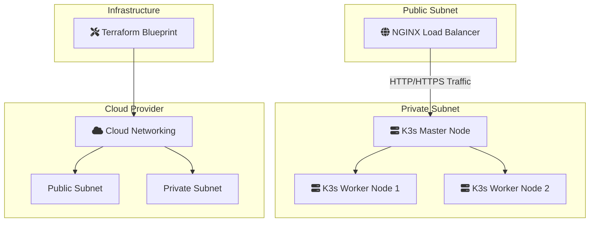

# 🚀 K3s AWS Infrastructure with Terraform

[](https://github.com/TheToriqul/k3s-aws-terraform)
[](https://github.com/TheToriqul/k3s-aws-terraform/stargazers)


## 📋 Overview

This project implements a production-ready K3s cluster on AWS using Terraform, showcasing infrastructure as code practices and cloud-native technologies. Through this implementation, I've created a robust, scalable Kubernetes environment that demonstrates modern DevOps practices and cloud architecture patterns.

## 🏗 Technical Architecture

The infrastructure consists of a highly available setup deployed across multiple availability zones in AWS, utilizing various services to ensure reliability and security.



## 💻 Technical Stack

- **Infrastructure**: 
  - Terraform v1.0+
  - AWS Provider ~> 4.0
- **Compute**: 
  - EC2 t3.medium instances
  - Ubuntu 20.04 LTS
- **Networking**: 
  - Custom VPC
  - Public/Private Subnets
  - NAT Gateway
  - Application Load Balancer
- **Container Orchestration**: 
  - K3s v1.21+
  - NGINX Ingress Controller

## ⭐ Key Features

1. **Automated Infrastructure**
   - Complete IaC implementation
   - Modular Terraform structure
   - Reusable components

2. **Network Security**
   - Private subnet isolation
   - Security group policies
   - NAT Gateway configuration

3. **High Availability**
   - Multi-AZ deployment
   - Load balancer integration
   - Automated health checks

4. **Kubernetes Platform**
   - K3s lightweight distribution
   - NGINX ingress controller
   - Automated cluster setup

5. **Monitoring & Access**
   - SSH key-based access
   - Load balancer metrics
   - Instance monitoring

## 📚 Learning Journey

### Technical Mastery:
1. Advanced Terraform module design
2. AWS networking concepts and implementation
3. Kubernetes deployment automation
4. Infrastructure security best practices
5. High availability architecture patterns

### Professional Development:
1. Infrastructure as Code methodology
2. Cloud architecture design
3. Security-first thinking
4. Documentation practices
5. DevOps workflow optimization

## 🔄 Future Enhancements

<details>
<summary>View Planned Improvements</summary>

1. Implement auto-scaling groups
2. Add cluster monitoring with Prometheus
3. Integrate CI/CD pipeline
4. Implement backup solution
5. Add service mesh capability
6. Enable SSL/TLS termination
</details>

## ⚙️ Installation

<details>
<summary>View Installation Details</summary>

### Prerequisites
- AWS CLI configured
- Terraform >= 1.0.0
- SSH key pair
- AWS credentials

### Setup Steps
1. Clone the repository
```bash
git clone https://github.com/TheToriqul/k3s-aws-terraform.git
cd k3s-aws-terraform
```

2. Initialize Terraform
```bash
terraform init
```

3. Configure variables
```bash
cp terraform.tfvars.example terraform.tfvars
# Edit terraform.tfvars with your values
```

4. Apply the configuration
```bash
terraform apply
```
</details>

## 📫 Contact

- 📧 Email: toriqul.int@gmail.com
- 📱 Phone: +65 8936 7705, +8801765 939006

## 🔗 Project Links

- [GitHub Repository](https://github.com/TheToriqul/k3s-aws-terraform)
- [Documentation](https://github.com/TheToriqul/k3s-aws-terraform/wiki)

## 👏 Acknowledgments

- [Poridhi for excellent labs](https://poridhi.io/)
- AWS Documentation
- Terraform Community
- K3s Documentation

---

Feel free to explore, modify, and build upon this configuration as part of my learning journey. You're also welcome to learn from it, and I wish you the best of luck!