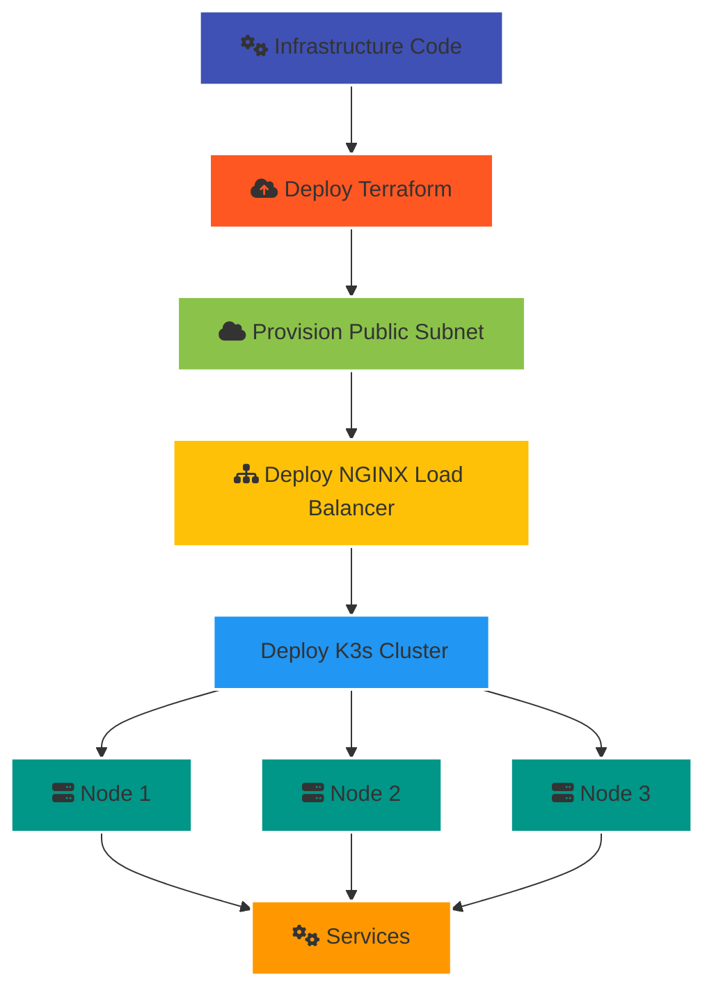

```mermaid
flowchart TD
    A[<i class="fa fa-cogs"></i> Infrastructure Code] --> B[<i class="fa fa-cloud-upload-alt"></i> Deploy Terraform]
    B --> C[<i class="fa fa-cloud"></i> Provision Public Subnet]
    C --> D[<i class="fa fa-sitemap"></i> Deploy NGINX Load Balancer]
    D --> E[<i class="fa fa-cluster"></i> Deploy K3s Cluster]
    E --> F[<i class="fa fa-server"></i> Node 1]
    E --> G[<i class="fa fa-server"></i> Node 2]
    E --> H[<i class="fa fa-server"></i> Node 3]
    F --> I[<i class="fa fa-cogs"></i> Services]
    G --> I
    H --> I

    style A fill:#3F51B5, stroke:#fff, stroke-width:2px
    style B fill:#FF5722, stroke:#fff, stroke-width:2px
    style C fill:#8BC34A, stroke:#fff, stroke-width:2px
    style D fill:#FFC107, stroke:#fff, stroke-width:2px
    style E fill:#2196F3, stroke:#fff, stroke-width:2px
    style F fill:#009688, stroke:#fff, stroke-width:2px
    style G fill:#009688, stroke:#fff, stroke-width:2px
    style H fill:#009688, stroke:#fff, stroke-width:2px
    style I fill:#FF9800, stroke:#fff, stroke-width:2px
```